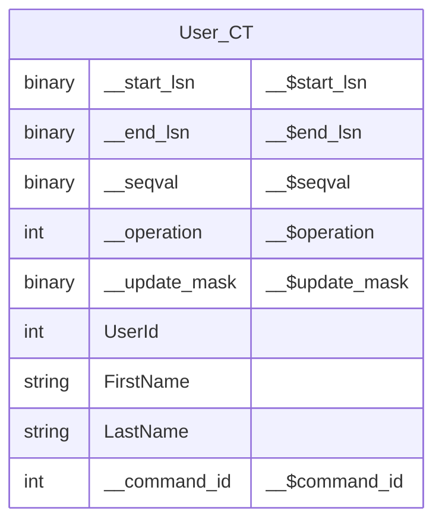

```mermaid
erDiagram
    User_CT{
        binary __start_lsn "__$start_lsn"
        binary __end_lsn "__$end_lsn"
        binary __seqval "__$seqval"
        int __operation "__$operation"
        binary __update_mask "__$update_mask"
        int UserId
        string FirstName
        string LastName
        int __command_id "__$command_id"
    }

```